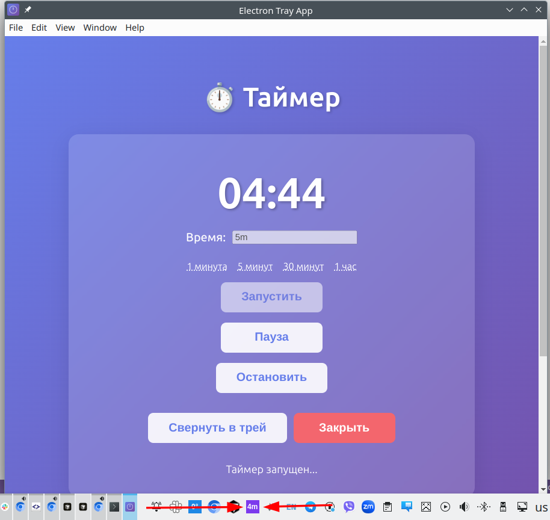

# Electron Tray Timer App (TypeScript)

Таймер на TypeScript и Electron с иконкой в системном трее.

Сгенерировано в Cursor. Код нужно выверить (не было времени это сделать), но вроде всё работает как надо.



## Функциональность

- При закрытии окна приложение сворачивается в системный трей
- Иконка в трее с контекстным меню
- Пункт меню "Выход" для полного закрытия приложения
- Двойной клик по иконке в трее открывает окно

## Как запустить

Открыть раздел "Releases" в гитхаб-репозитории. Открыть последний релиз. Скачать архив, соответсвующий используемой операционной системе, разархивировать, запустить.

### Linux

Скачать `electron-tray-timer-1.0.0.zip`, разархивировать, запустить (`ELECTRON_DISABLE_SANDBOX=1 ./electron-tray-timer`)

### Windows

Скачать `Timer.Tray-1.0.0-win.zip`, разархивировать, запустить exe-файл ("Tray Timer.exe")

Windows может ругнуться на запуск программы из непроверенного источника


В Windows может быть необходимо включить скрытую иконку


### macOS

Использовать архив `Timer.Tray-1.0.0-mac.zip`

## Запуск через npm

```bash
npm install
```

## Запуск

```bash
npm start
```

## Разработка

Для разработки с автоматической пересборкой:

```bash
npm run dev
```

## Решение проблем

### Ошибка SUID sandbox на Linux

Если при запуске возникает ошибка с `chrome-sandbox`, есть два способа решения:

1. **Исправить права на файл** (требует sudo):
   ```bash
   sudo chmod 4755 node_modules/electron/dist/chrome-sandbox
   ```

2. **Использовать флаг отключения sandbox** (уже настроено в скриптах):
   Скрипты уже используют `ELECTRON_DISABLE_SANDBOX=1`, что решает проблему автоматически.

## Структура проекта

- `src/main.ts` - главный процесс Electron
- `src/index.html` - интерфейс приложения
- `dist/` - скомпилированные файлы (создается автоматически)

